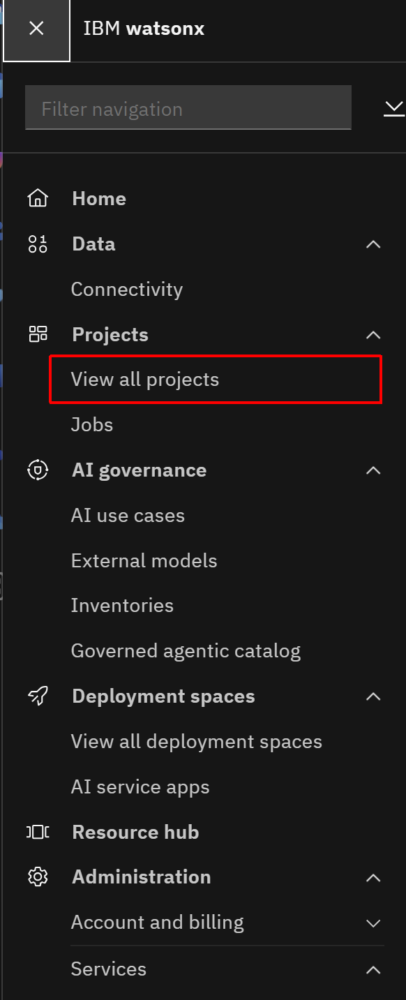
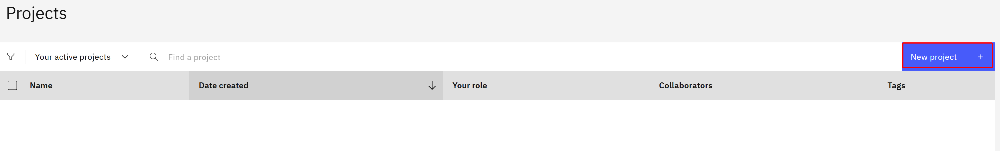
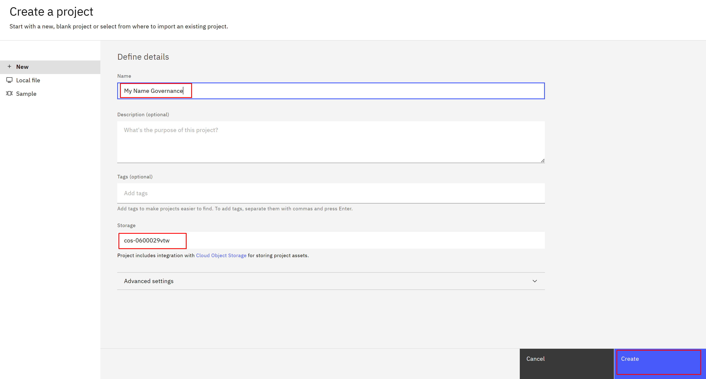

#  Creating a new project

1. Click on the hamburger menu on the top left and pick **View All Projects**  

2. Click on the **New Project +** button  

3. Pick a name for the project that includes your name, and select the Cloud Object Storage.  

4. With the project created, you should be directed to the project home page. Select the "Manage" tab.

Click on "Services and Integrations" in the left sidebar. Then, click on "Associate service."

Select the service listed with "Type" = "watsonx.ai Runtime" and click **Associate**. 

**Note:** If you can't find the service, remove all filters from the "Locations" dropdown. If you see 2+ Watson Machine Learning services, select the one where "Group" = the same *environment* name of the instance. The *environment* name can be found on https://techzone.ibm.com/my/reservations. 

