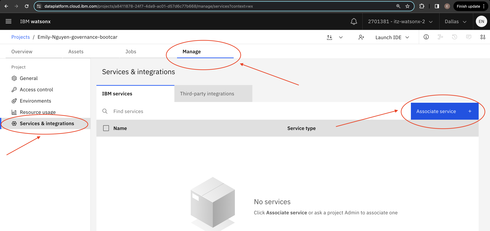
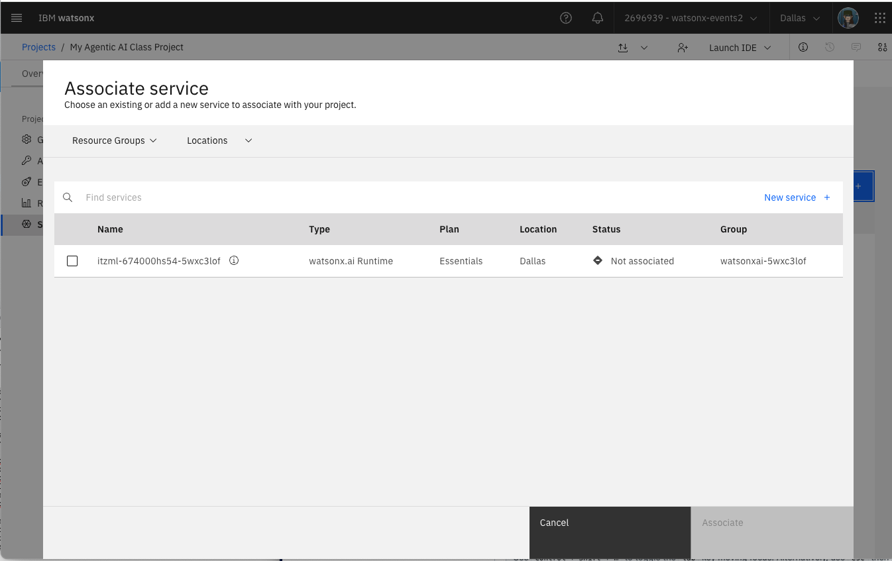

# 🤔 Automatic Evaluation

*Automatic Evaluation* – Automatic evaluation allows you to assess AI model quality at scale by using predefined metrics and test cases rather than relying solely on manual reviews. This improves consistency and helps you spot issues early.

‼️ Automated tools make it easier to validate outputs, detect regressions, and ensure your model meets performance expectations.

🧪 This lab builds on concepts from Evaluating Studio and gives you experience with automatic evaluation techniques, helping you streamline quality control in AI workflows.

# 🧪 Run the Evaluation

Imagine you’re building a Retrieval-Augmented Generation (RAG) assistant to help employees get answers to common HR questions, such as benefits, policies, or time-off rules. Your assistant retrieves documents or structured data (like tables) and then uses a prompt to generate natural language answers.

Your task now is to evaluate different prompts designed for this use case. We’ll use **Evaluation Studio** to automate and streamline this comparison.

🗂️ The test data we’re using is [Employee Benefits Dataset](./datasets/ibm_benefits_rag_qa_dataset.csv) containing realistic employee queries and expected answers.

## 🔬 Create Prompt Templates

📥 **Step 1: Download the ZIP File**  
Download the data and prompt content to be used in this hands-on lab from the link below:

> 🔽 [Download Automatic Evaluation ZIP](./assets/Automatic-Evaluation.zip)


📄 **Step 2: Import the project**  
- Go to the watsonx landing page, scroll down to the **Projects** section and and then click on the **+** button (**Create a New Project**).


- Select **Local file** and then browse for the ZIP file you just downloaded above.


- Give it a name, say **Automatic Evaluation** and then click **Create**. Click on **View in Project**


- Now go to **Assets**, and you should see 3 Prompt Templates.
- Open each one of them and spend some time reviewing the prompts and LLMs being used for each Prompt Template. They should look like this:


With the project created, you should be directed to the project home page. Select the "Manage" tab.

Click on "Services and Integrations" in the left sidebar. Then, click on "Associate service."



Select the service listed with "Type" = "watsonx.ai Runtime" and click **Associate**. 



**Note:** If you can't find the service, remove all filters from the "Locations" dropdown. If you see 2+ Watson Machine Learning services, select the one where "Group" = the same *environment* name of the instance. The *environment* name can be found on https://techzone.ibm.com/my/reservations. 


When experimenting, it is common to try out different prompts and LLMs to maximize performance. watsonx.governance allows you to automatically run experiments on multiple Prompt Templates as we will see next.

## 🔬 Create the Evaluation Experiment

1. **Navigate to your project** in watsonx.
2. Go to the **Assets** tab and click **New asset**.


3. On the **What do you want to do?** screen, search for Evaluate and Compare and click on **Evaluate and compare AI Assets**..


4. Name your experiment something meaningful like ```Employee Benefits Auto Evaluation - [YourInitials]```. Then select **Prompt templates** and click **Next**.


5. Set the **Task type** to `RAG` and click **Next**.


6. Select the three prompt templates you have created for the assistant:

   * One using `granite 3-2-8b instruct`
   * One using `llama 3-2-3b`
   * One using `mistral-medium`

Then click **Next**.


7. On the Evaluate and compare prompts screen, review the different metrics which you are
evaluating against. These fall under the categories Generative AI Quality and Model Health and
can be configured from here if needed. Click on Next.


---

## 📊 Configure Evaluation Metrics

8. Evaluation Studio supports both generative quality and model health metrics. Here we can configure new metrics. 


For employee Q\&A, we care about:
* **Accuracy**: How close is the answer to the expected answer?
* **Conciseness**: Is the answer short and to the point?
* **Jaccard similarity**: Textual similarity to ground truth.
* **Output token count**: Lower token count = cheaper cost.

9. Go to settings on top right corner and select the following metrics: Answer Quality, Retrieval Quality, Content Analysis, ROUGE, BLEU, etc.


10. Review the default metrics, e.g., for Answer Quality (you can adjust them later).


11. If no Gen-AI evaluator has been set up already, click Manage to configure one.


12. Click on **Add**  


14. Provide a name (e.g., Granite Evaluator), enter the API key, and choose a predefined Watsonx.ai foundational model such as Granite-3.8B or Mistral-Large.


15. Alternatively, if you prefer not to use the predefined options, select Other foundational model and enter the model ID (e.g., ibm-granite/granite-3.3-8b-instruct). Then confirm with OK.


17. Finally, click Save to store the evaluator configuration.


---

## 📁 Load and Map the Test Data

1. On the **Evaluate and Compare AI asset screen** screen, go to **RAG specific settings** below.
2. In the input field of Question "select a variable", map the 'question' from the dropdown.


3. In the input field of Context "select a variable", map the 'context' from the dropdown.


4. Click **Next** and review the setup.
   


5. On the **Evaluate and Compare AI asset screen**, from the metrics tab we have shifted to test data tab (check left side of screen). 
You can **Drop data files here or browse for files to upload** or Select data from project.  In this case the test data is already in the project as a Data Asset called ***ibm_benefits_rag_qa_dataset (1).csv***


6. After uploading the test data, in Input mapping map the question with 'question' and context with 'context'


7. For Output mapping, map the Reference Output with 'answers'.


8. On the **Evaluate and Compare AI asset screen** screen, from test data tab we have shifted to Review and run tab (check left side of screen). Click on the checkbox of allow service to create,use and store task credentials & click on Create.
   


9. The evaluation has begun. This will take a few minutes.


---

## 📈 Analyze the Results

Once completed, dive into the results.

### Total Records


### Input Token Count

* Which prompt is most concise in input usage?
* Are you using unnecessary instructions?


### Output Token Count

Assess how verbose the responses are.

* Do longer outputs mean better answers?
* Are some prompts too short to be helpful?


### Content Analysis

Switch to **Content Analysis** from the drop down on the right side:


### Answer Quality
📌 Look for dotted orange lines — these are thresholds. Try to stay within the recommended range like in the image below.


---

## 🧠 Custom Ranking
1. Click the icon beside drop down on right, it will open the custom ranking dialog box. 


2. Not all metrics are equally important. For this HR assistant, we care most about:

* **Faithfulness** → weight = `1`
* **Token cost (input + output)** → weights = `-1.5` each (optional)
* **Conciseness** → weight = `-1` (optional)
  


3. Click **Apply**, and sort the ranking.


4. You can pin one of the prompt and see the results. How are they varying.

* Click on the pin button on left side near prompt templates. Pinning the Granite Model.


    
* Pinning the Mistral Model.


---

## ✅ Select the Best Prompt

Based on your blended metrics, identify the top-performing prompt. For example, if the **granite-based prompt** ranks best overall, we can track it.

We’ll assume that any threshold gaps (e.g., similarity under 0.7) will be addressed in the next prompt revision cycle.


You did amazing!! You finished the first portion of the bootcamp! 

Good luck and continue practicing your skills!
