# 📈 Drift Monitoring

*Drift Monitoring* - Drift occurs when an AI model's performance degrades over time due to changes in data or user behavior that differ from its original training environment. This can lead to less accurate outputs.

‼️ Keeping an eye on drift helps you catch when a model starts slipping, such as giving weaker answers or not working like it used to.

🧪 This lab helps you explore how to identify and respond to model drift, equipping you with practical tools to maintain long-term quality of AI systems.

Before starting this lab, make sure you have completed the [Hallucinations Lab](./hallucinations.md), as it explains to you how metrics are evaluated and why they're important.

## 📝 Creating a Prompt Template

You will deploy a prompt template that summarizes employee benefits into production and will then monitor it. You’ll use different datasets with different characteristics in them. This will help you understand how watsonx.governance allows to automatically compute drift and trigger alerts if there are significant changes in the data that might lead to performance degradation.

1. Open **Prompt Lab** and go into the **Structured** tab. Then, add an input variable **text** as indicated below:
   ```
   Summarize the following employee benefit description.
   ```

   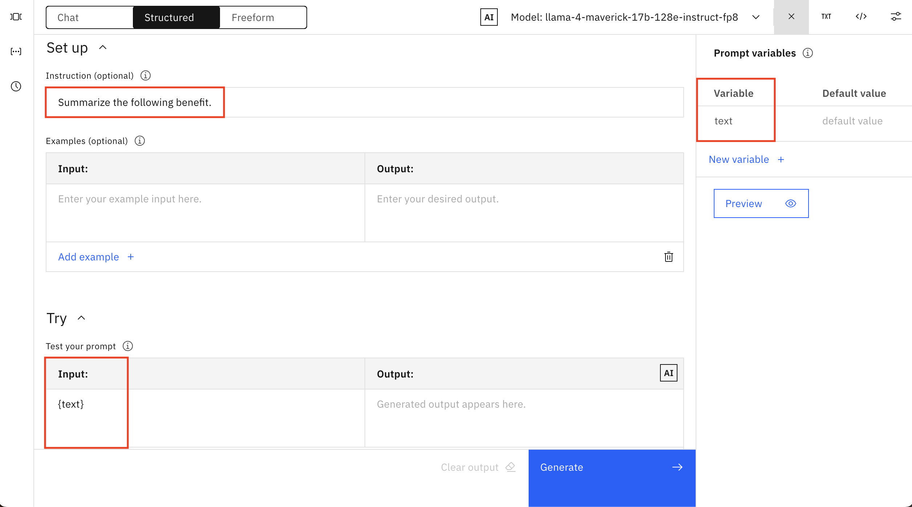

2. After generating this prompt, save your work as a **Prompt Template**, give it a name, and assign it the **Summarization** task.

   
   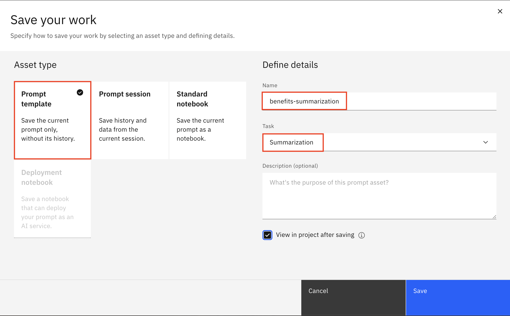

3. Go to your project, go to **Assets** and find your recently saved Prompt Template, click on the three dots and select **Promote to Space** to deploy it.

   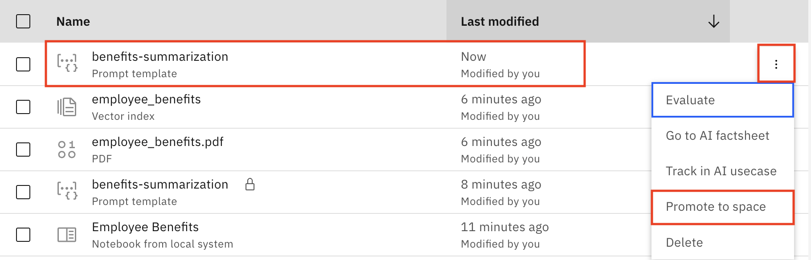

4. In order to promote your Prompt Template you'll need to create a new **Deployment Space**, if you haven't already. Deployment Spaces can host multiple deployments related to a usecase. Give it a name and select the **Production** deployment stage.


   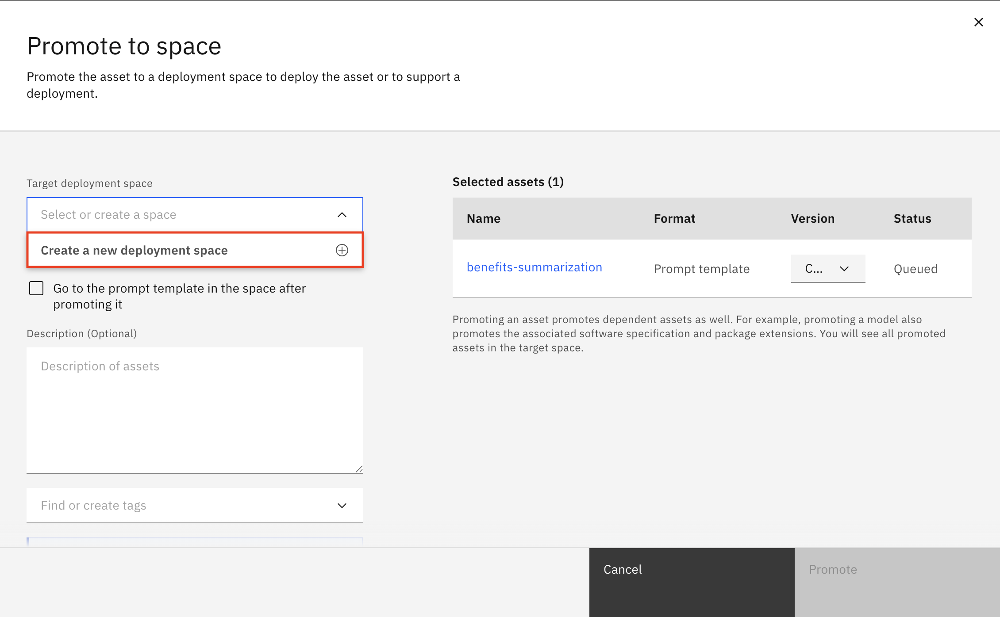
> [!NOTE]
> It is very important to select **Production** as deployment stage since it is only in **Production** stage that you can monitor drift.

   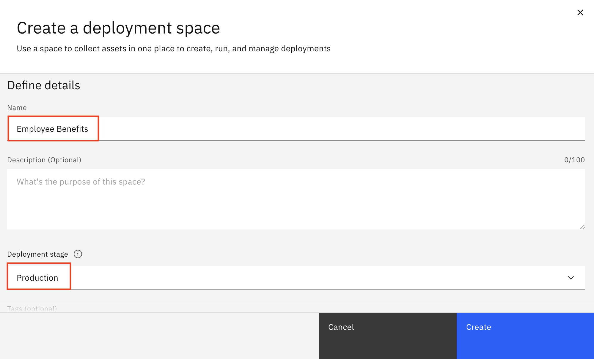

5. Once you've created your deployment space, you'll be able to now promote your Prompt Template to it by choosing it as your target deployment space. Associate it with your watsonx.ai Runtime, and then click on **Promote**.

   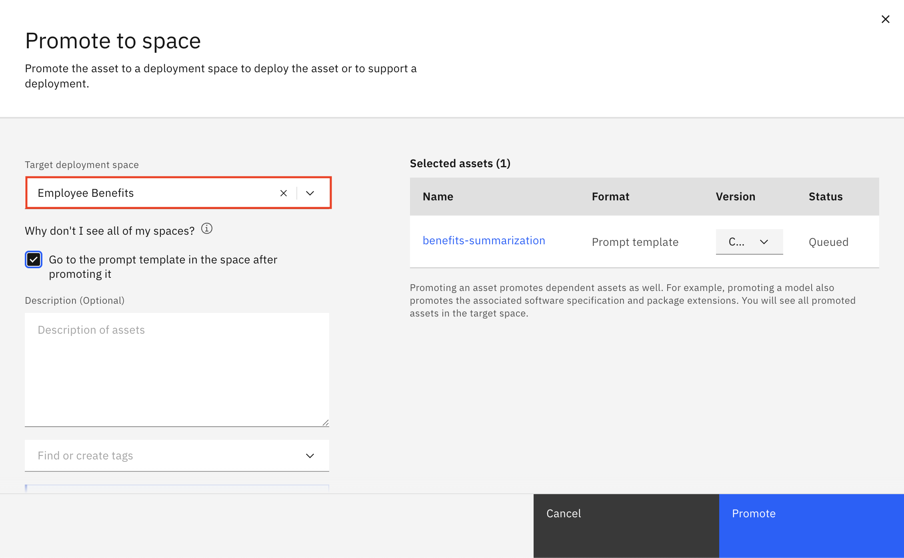
   
> [!NOTE]
> Make sure you have a watsonx.ai runtime service instance associated with your Deployment Space. 
   
<!--
6. Click on **Go to space settings** and associate an instance in the bottom right corner.

   

7. As shown, in the bottom right corner, click on **Associate instance** and choose from the dropdown menu. Once chosen, click on **Save**.

   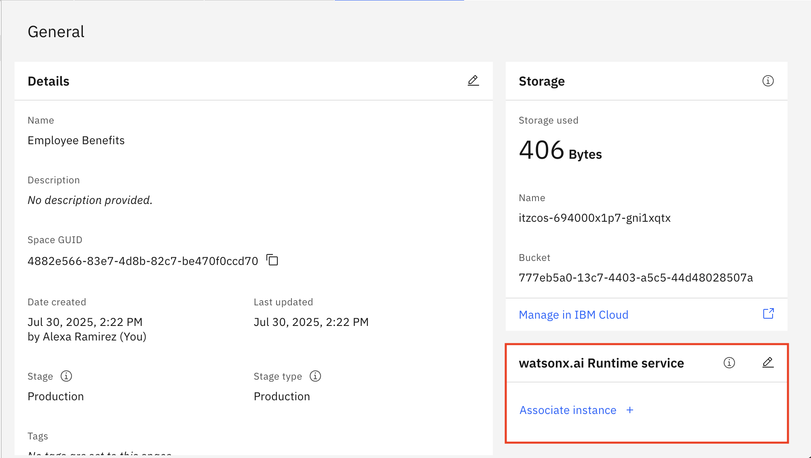
   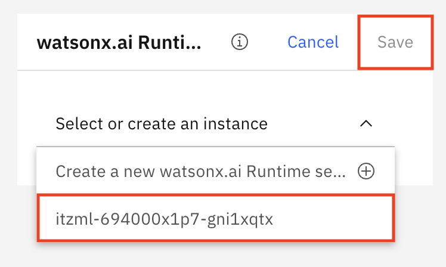
-->

6. Click on **Go to deployment** and then go to the **Assets** section to find your promoted prompt template and click on it.
   
   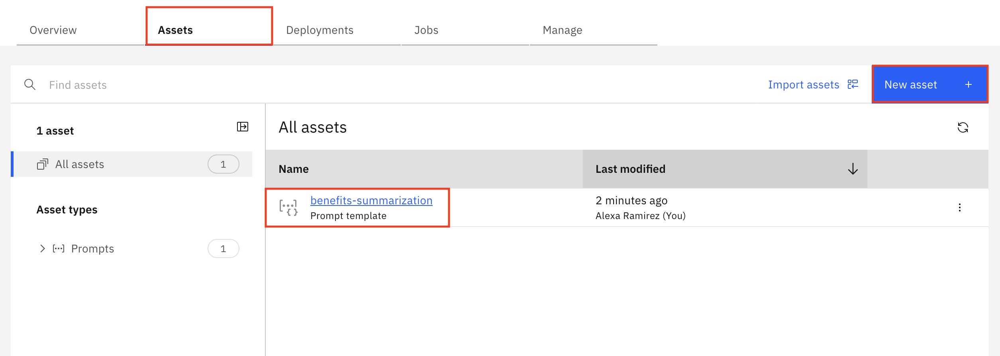

7. Create a **New Deployment** by clicking on the blue button. When creating it, give it a name and click on **Create**.

   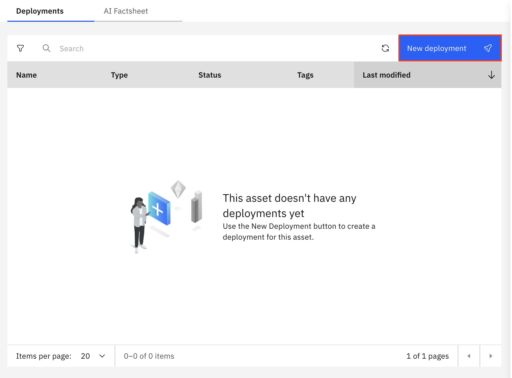
   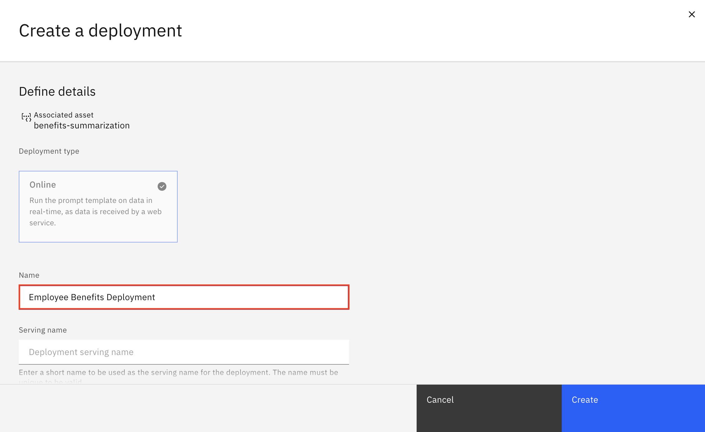

8. Click on the name of the deployment you just created. Click on the **Evaluations** tab and then click on **Activate**.

   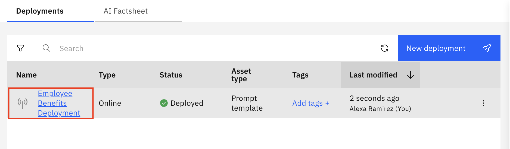
   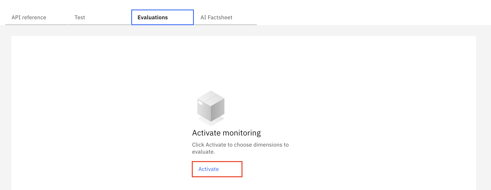

9. In order to evaluate the prompt template, select the Dimensions you'd like to monitor. Make sure you enable Drift and Generative AI Quality. Both are useful to assess how good the model or prompt is performing. No further changes are needed so just click **Next** twice. Then click on **Activate** to create your monitors.

   
   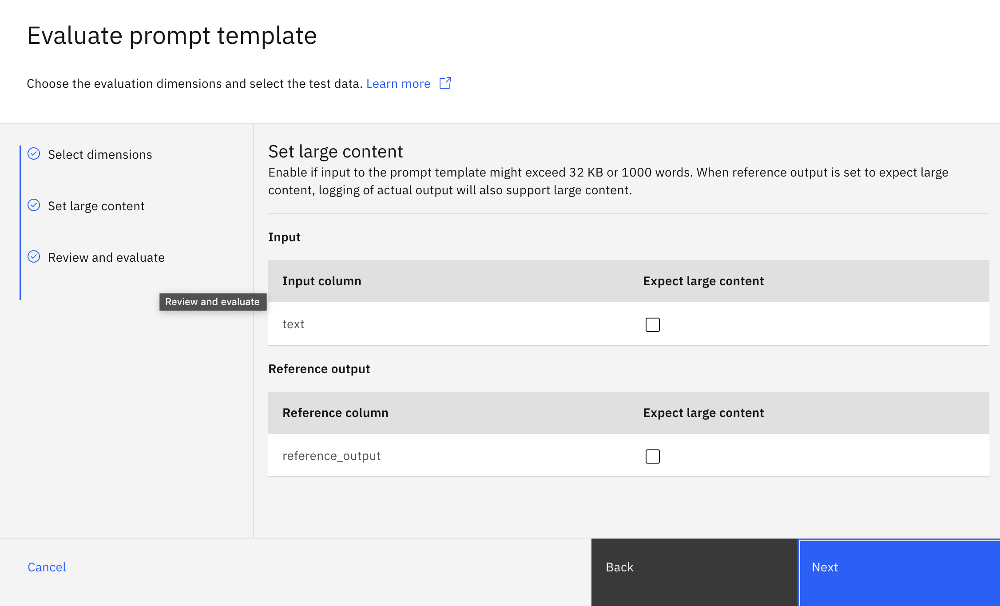 
   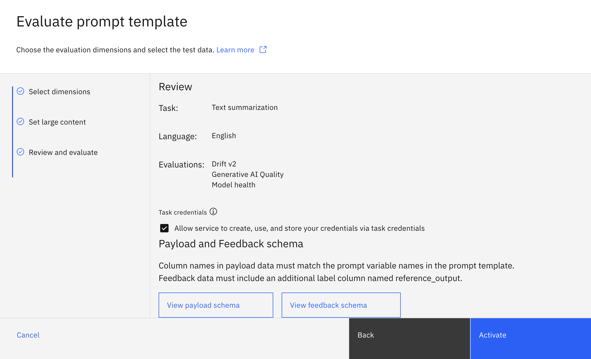

10. Once you're able to see all the evaluation details, go to **Actions** and then **Evaluate Now** option.

    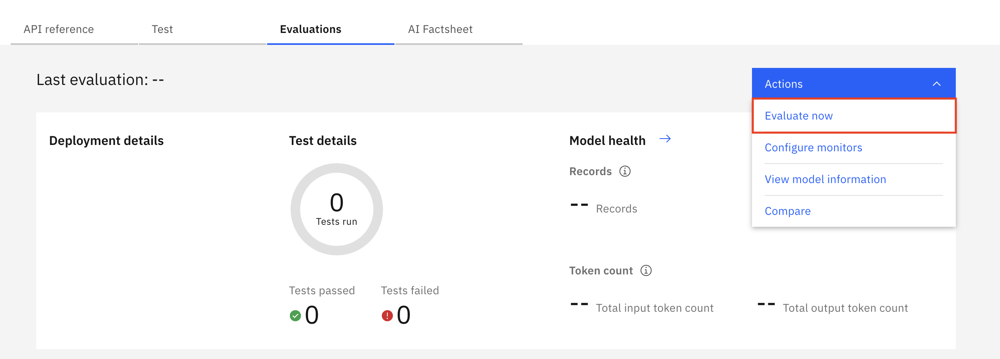

11. Download the [Short Answer Dataset](./datasets/synthetic_short_descriptions.csv), [Medium Answer Dataset](./datasets/synthetic_medium_descriptions.csv), and the [Long Answer Dataset](./datasets/synthetic_long_descriptions.csv). 

    To simulate real time monitoring of this Prompt Template on watsonx, we created three versions of a dataset based on IBM’s employee benefits content, including topics such as flexible scheduling, mental health support, pet perks, and more. 
    
    The long dataset includes a comprehensive set of these benefit descriptions with varying phrasings and formats. It’s designed to give the model richer, more diverse context to work with when responding to questions. The shorter datasets are subsets of this larger one and are used to test how the model performs with less or more limited input.

    By uploading these datasets into watsonx, we are simulating changes in the data (as they could happen in a real-world scenario), which will be detected by the drift monitor. watsonx.governance allows you to assess how well the model grounds its answers in the context and maintains its quality across different amounts of input content.

13. After downloading the three datasets, upload the [Short Answer Dataset](./datasets/synthetic_short_descriptions.csv) first by clicking on the **Upload Payload Data** button. Select the **Comma (,)** separator option and click on **Evaluate Now**.

    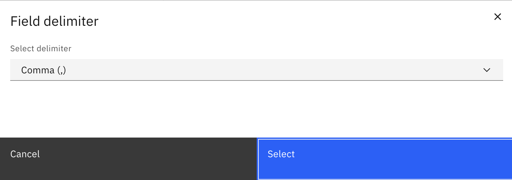
    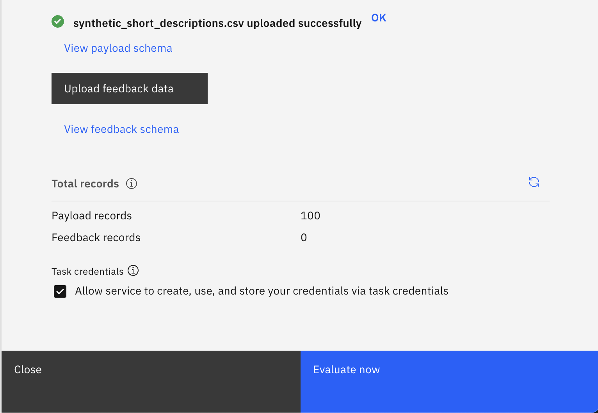 


14. Once uploaded, wait for 5 minutes and repeat Step 12 by uploading the [Medium Answer Dataset](./datasets/synthetic_medium_descriptions.csv). Then wait 5 more minutes upload the [Long Answer Dataset](./datasets/synthetic_long_descriptions.csv). Waiting for 5 minutes between runs allows for a nicer plot of real time data as we will see very soon. 

    The payload dataset simply a number of inputs to the Prompt Template. In this case, since our Prompt Template's goal is to summarize employee benefits, each example in the dataset is an employee benefit description to be summarized. watsonx.governance allows to:
  -** Compare outputs over time**: check whether the summaries generated remain high-quality over time

  - **Detect shifts early: **if the model starts generating summaries that score lower on quality metrics.

  **- Establish baselines: **The first uploaded payload often acts as a reference point, while future payloads are measured against it to detect drift.

    We designed the datasets files with different characteristics, some with short answers, others with longer answers, to make it easier to measure drift. By artificially creating this contrast, we can better observe how certain variables, like the number of tokens, impact drift calculations.

## 🔍 Analyzing Datasets

Drift monitoring is important because it helps detect when a model’s behavior changes over time, especially if it starts generating responses that no longer align with its original training data. These shifts can reduce the reliability, fairness, and accuracy of AI outputs.

On watsonx, drift monitoring allows us to track whether the model's answers to prompts remain consistent, accurate, and grounded as new data are introduced. Drift monitoring tracks how the model's outputs change over time compared to a reference set. The key metrics help detect whether your model’s behavior is shifting, which could signal performance issues.

15. Scroll down on your evaluation details and click on the blue arrow under **Drift v2** in order to look at more detailed metrics.

    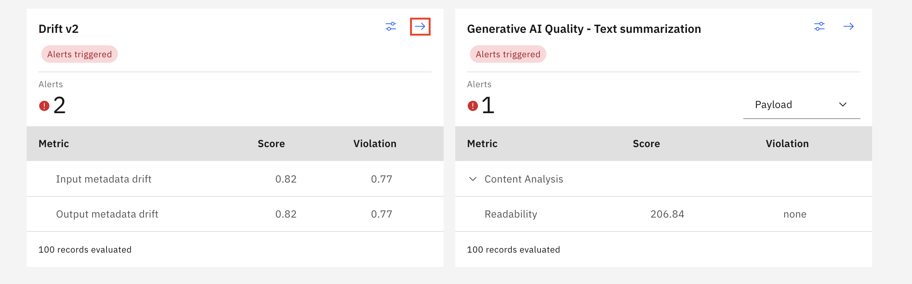
    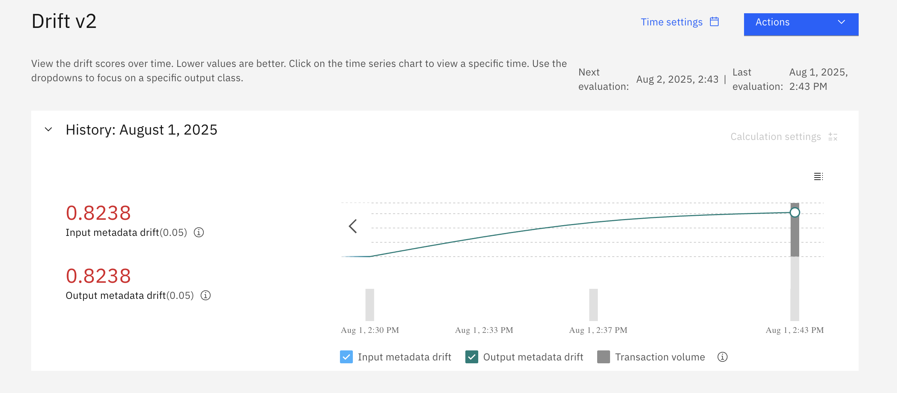 
    
    The Drift v2 dashboard indicates a high Drift measure for both input and output data for summarizing employee benefits. This suggests that the characteristics of the new data are changing significantly over time. Such high drift may impact the quality and relevance of the generated summaries.
    
    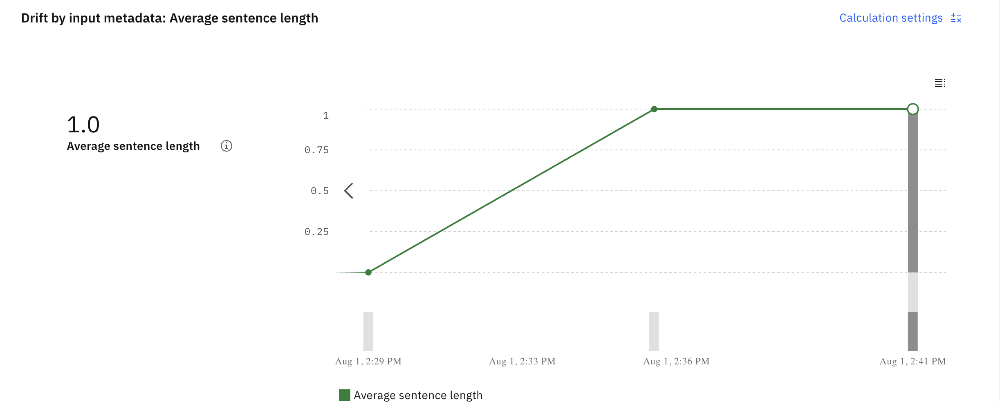

    This graph illustrates the drift in average sentence length over time, showing how the input data's structure has changed. The average sentence length was near zero, suggesting very short or possibly incomplete inputs. Over the next few minutes, the average length increased sharply and then stabilized, indicating more consistent and longer sentences. This change may signal a shift in the nature of incoming data, which could impact model performance.
    
To prevent drift in your model, it's important to keep the model aligned with changing data. This involves regularly updating the model with fresh, representative training data and maintaining prompt templates. 

Ongoing monitoring through tools like watsonx.governance helps detect and address issues early, ensuring the model continues to perform reliably and reflect current content accurately.

🥳 Great job on completing this section!! Please continue to the [following lab](./automatic-eval.md)!
