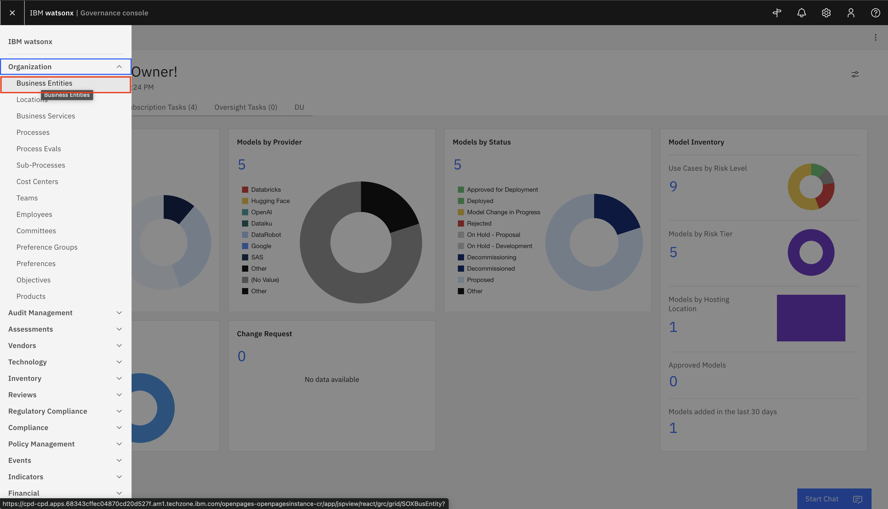
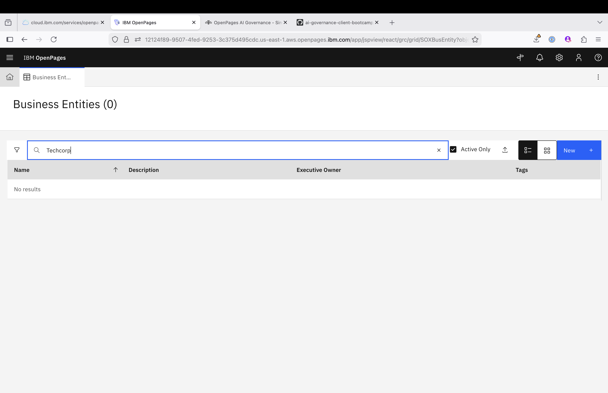
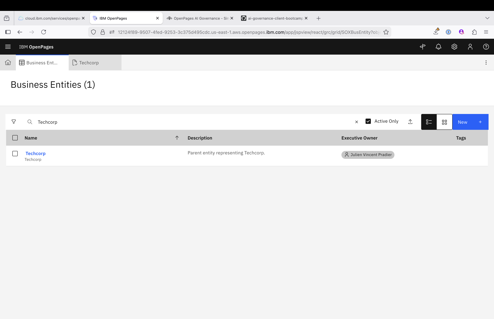
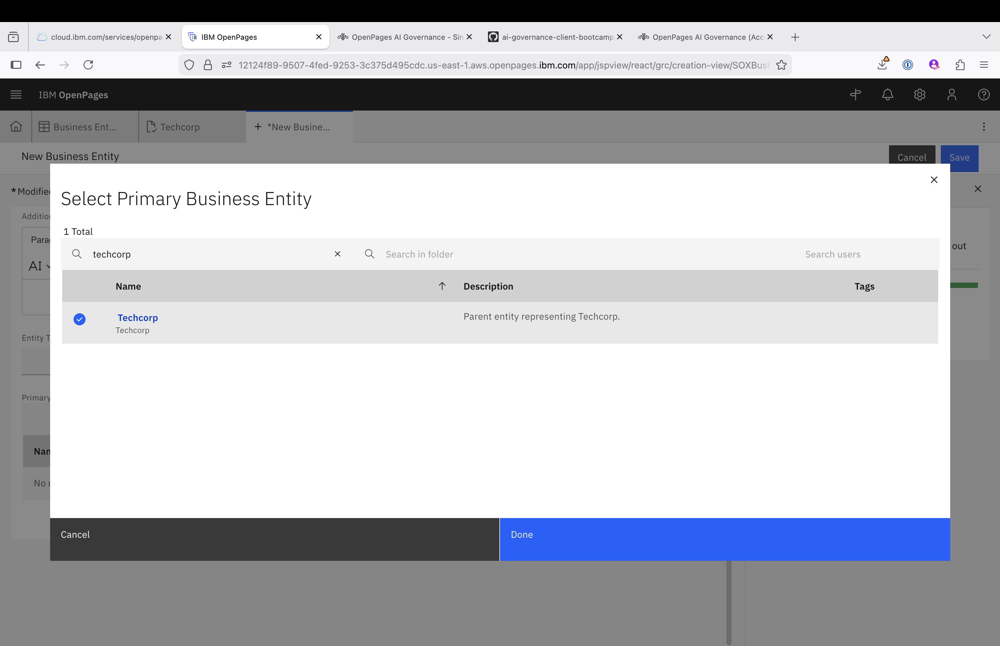

> ⚠️ **Login Note:** Before starting, ensure you are logged into **IBM OpenPages** using the **Use case owner** role.
> This access is required to create and manage **Business Entities**, **Model Use Cases**, and perform associated governance tasks.

# 📊 Business Entity Creation in watsonx.governance

## 📌 Overview

This guide walks you through creating a **Primary Business Entity** and a **Child Business Entity** in watsonx.governance for the **AskHR Project**, under the **Techcorp** organization.

---

## 🏢 Business Entity Creation

In **IBM OpenPages**, a **Business Entity**:

* Represents a logical division or unit within an organization.
* Serves as a container for managing risks, controls, issues, and processes.
* Supports parent/child hierarchy to enable structured governance.

---

## 🎯 Structure to Be Created

| Entity Level   | Entity Name   | Description                                                        |
| -------------- | ------------- | ------------------------------------------------------------------ |
| Primary Entity | Techcorp      | Main entity representing the organization.                         |
| Child Entity   | HR Business Entity | Entity that will request the new GenAI, linked to Techcorp. |

---

## 🛠️ Step-by-Step Creation Process

### 1️⃣ Step 1: Create or Locate the Primary Business Entity — Techcorp

For this Lab, we are pretending we all work for the **Techcorp** Business Entity, under a Child Business Entity named **HR Business Entity**
Because, this is a shared environment, we will first need to locate the common Primary Business Entity **Techcorp**. If this entity doesn't exist, the first student needs to create it.

1. **Log in as:**
   `Use case owner`

2. **Navigate to the Business Entity Section:**

   * Click the **Hamburger Menu (☰)**.
   * Go to **Organization**.
   * Select **Business Entity**.

   

3. **Search for Techcorp**

   

   If No results, then proceed to step 4, otherwise click on the **Techcorp** business entity and proceed to [Jump to Step 2 — Create Child Business Entity](#step-2-create-child-entity)

4. **Create a New Entity:**

   * Click **Create New**.
   * Fill in the following fields:

   | Field             | Value                                |
   | ----------------- | ------------------------------------ |
   | **Entity Name**   | `Techcorp`                           |
   | **Description**   | Techcorp is a technology-driven company specializing in HR automation solutions that streamline and optimize human resource operations for modern organizations. Our mission is to eliminate manual, repetitive HR tasks and empower HR teams to focus on what truly matters—strategic people initiatives that drive organizational growth. By leveraging cutting-edge automation, analytics, and seamless integrations, Techcorp delivers scalable solutions that improve efficiency, reduce errors, and enhance the employee experience. |
   | **Owner**         | Use case owner     |
   | **Business Unit** | As applicable                        |

4. **Click Save.**

   

<!-- add explicit anchor for a stable jump target -->

### 2️⃣ Step 2: Create the Child Business Entity 

1. After **Techcorp** is created or located, go back to the Entity Listing click **New** again to add the child entity.

   

2. Fill in the following fields:

   | Field                       | Value                                                    |
   | --------------------------- | -------------------------------------------------------- |
   | **Entity Name**             | `HR Business Entity`                         |
   | **Description**             | Child entity for the GenAI AskHR project Use Cases. |
   | **Owner**                   | Use case owner / Governance Lead                         |
   | **Business Unit**           | As applicable                                            |
   | **Primary Business Entity** | Select `Techcorp` from the dropdown or lookup list.      |

   

3. ✅ **Ensure `Techcorp` is selected** as the **Primary Business Entity**.

   

4. **Click Save.**

---

## ✅ Example Child Entity Summary

* **Entity Name:** `HR Business Entity`
* **Description:** Child entity for the GenAI use case in the AskHR project.
* **Primary Business Entity:** `Techcorp`
* **Owner:** Use case owner

---

## 📊 Summary

By setting up:

* **Techcorp** as the **Primary Business Entity**, and
* **HR Business Entity** as a **Child Entity** linked to it,

You enable:

* Clear governance hierarchy
* Focused compliance tracking
* Organized risk and issue management within your AI initiatives

---

👏 **Well Done!**
Creating structured Business Entities in OpenPages sets a strong foundation for scalable, transparent, and well-governed AI initiatives.

---

[← Back to main guide](../../README.md)
[← Back to directory](../../guides-directory.md)

