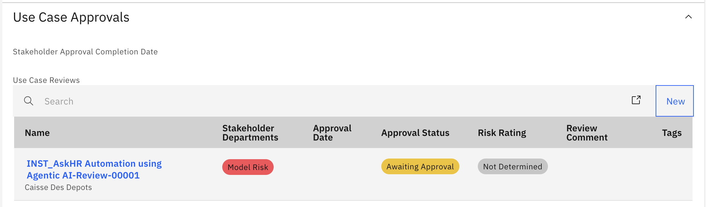
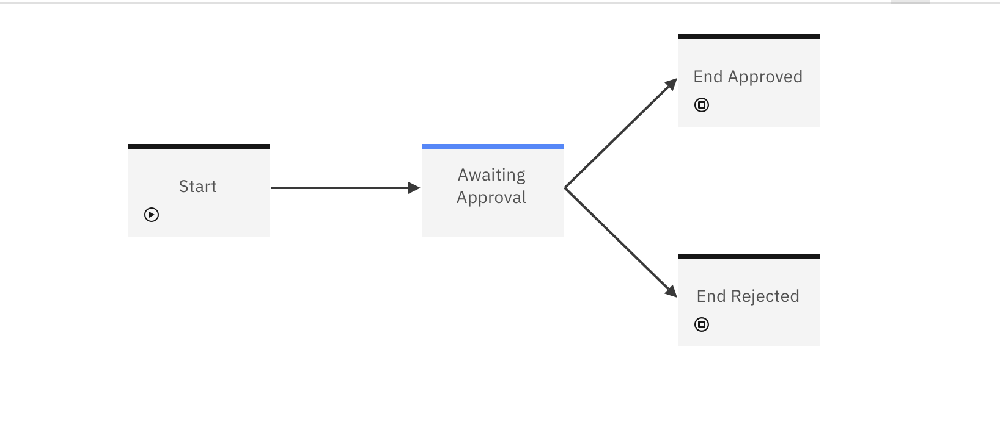
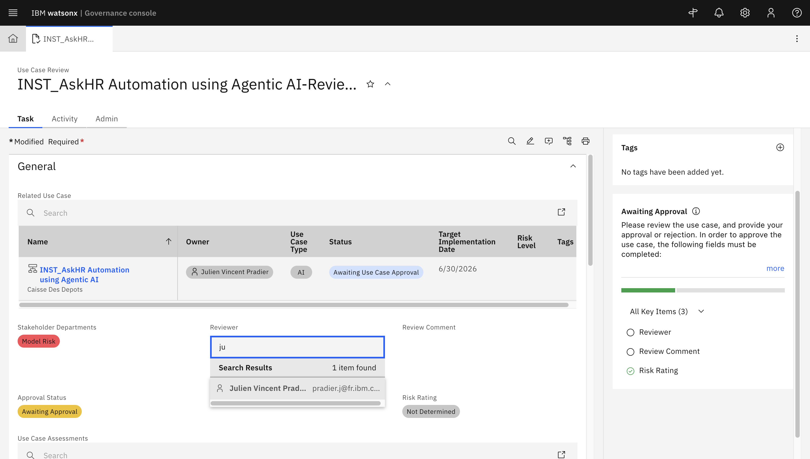
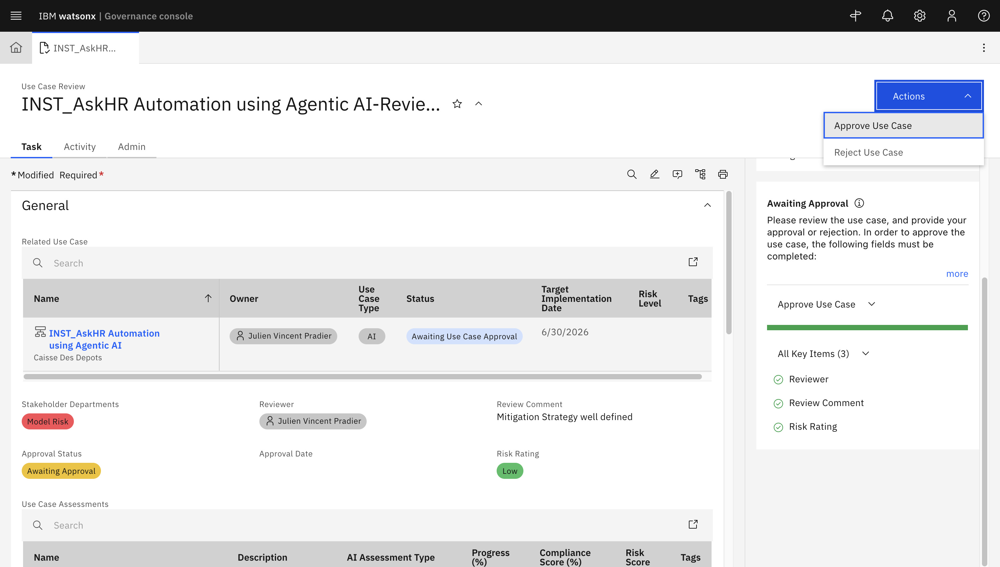

# 🛡️ Risk Review Process for Use case owner

> ⚠️ **Login Note:** Make sure you are logged into **IBM OpenPages** using the **Use case owner** role before starting this task.

 
 
> This role is required to review and approve risks submitted by the Use Case Owner.

---

## 📌 Overview

As a **Use Case Owner**, your responsibility is to review risks submitted as part of a Use Case and determine the appropriate risk status. This process ensures that all risks are evaluated, documented, and aligned with your organization's governance standards.

---

## 🧩 Workflow Context

This step occurs **after** a Use Case Owner:

* Creates a  Use Case, and
* Submits a Risk Identification Assessment.

You will now:

* Review the submitted risk,
* Perform assessments if necessary,
* Update the status, and
* Forward the task for stakeholder approval.

🧭 Steps:

| Step               | Action                        | Status Update                 |
| ------------------ | ----------------------------- | ----------------------------- |
| Risk Received      | Review risk description       | `Awaiting Assessment`         |
| Perform Assessment | (Optional) Add documentation  | `Awaiting Approval`           |
| Finalize Decision  | Approve / Mark Not Applicable | `Approved` / `Not Applicable` |

---

## 🛠️ Step-by-Step Task Instructions

### 1️⃣ Risks are populated and now **Use Case Owner** can review each risk:

  

---

### 2️⃣ Start Risk Assessement

* Open the risk record.

* Click on **Start Model Risk Assessment**, available on the Actions button. Click on Continue.

Then, click on the option **Ready for Assessment**, available on the Actions button.

---

### 3️⃣ Decide if a Risk Assessment is Required

| If...                   | Then...                                         |
| ----------------------- | ----------------------------------------------- |
| Assessment is required  | Proceed to fill in the Risk Assessment section. |
| No assessment is needed | Move directly to setting the risk status.       |

---

### 4️⃣ Perform Risk Assessment

* Open the risk record.
 
* Fill the field values including:

  * **Inherent Risk Rating** : This can be done by setting the Inherent Impact and Likelihood
  * **Mitigation Strategy** : Describe the strategy to mitigate the risk, that is monitoring the hallucinations related metrics.
  * **Residual Risk Rating** : This can be done by setting the Residual Impact and Likelihood
  

* Save and click on **Asssement Complete**:

* Choose **Continue and close tab**
---

---

### 5️⃣ Save and Complete the Task

* After completing all risk review. Go to actions and click **Submit for Stakeholder Review** to progress the workflow to the Stakeholder stage.

####  Process Several Risks - Bulk Operation

Nota: 
Please proceed with the following procedure If the message is displayed when submitting the case for stakeholder review. : "All associated risks should be assessed (marked as "Approved" or "Not Applicable") before submitting this use case for stakeholder review."

* Click on the Launch Grid Page section

* Select all the risk with status "Awaiting Assessment", then click on "Bulk update"

* Select field "Status", then click on "Not Applicable". Then, click on the button "Update"

* Close the confirmation window

* Close the risk window tab.

* Re-Open the Case. Go to actions and click **Submit for Stakeholder Review** to progress the workflow to the Stakeholder stage.

---

## 📋 Stakeholder Approval

Your Use Case has now been submitted for stakeholder review and approval. The Use Case is in the hands of the designated stakeholders and is in the Stakeholder stage of the Use Case Request workflow.

Before it can be moved to Approved for Development, the stakeholders must review the Use Case and either approve it or mark it as Not Applicable. 
The actual Use Case reviews (there is one review by stakeholder) are found in the Use Case Approvals section of the Use Case record.

Click on the Use Case Review record to open it.

The Use Case Review record will follow a simple Use Case Stakeholder Review workflow as configured in the system:

Before you can approve the Use Case, you may need to fill in some of the Use Case Review details:
- Stakeholder Name
- Stakeholder Comments
- Risk Rating

Once this information provided, you save and then click on the **Approve Use Case** button in the Actions menu.

Clock on **Continue and close tab** in the popup window and go back to your Use Case Record.

Ensure that all stakeholders have approved the Use Case.

---

## 🎉 Well Done!

By completing the **Risk Review**, you help ensure:

* Risks are properly assessed and documented,
* Compliance is upheld,
* The organization follows a consistent and accountable risk management process.

---

[← Back to main guide](../../README.md) 
[← Back to directory](../../guides-directory.md)

