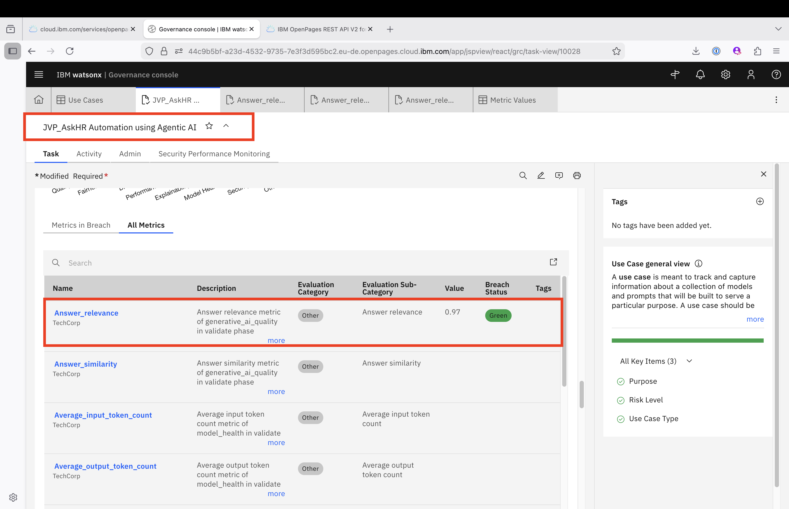
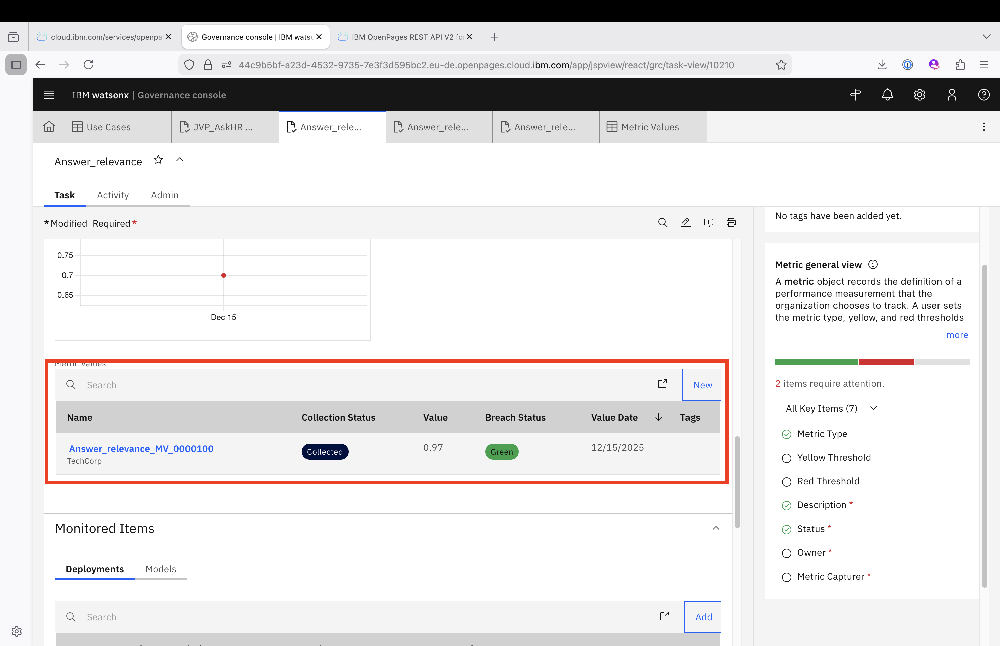
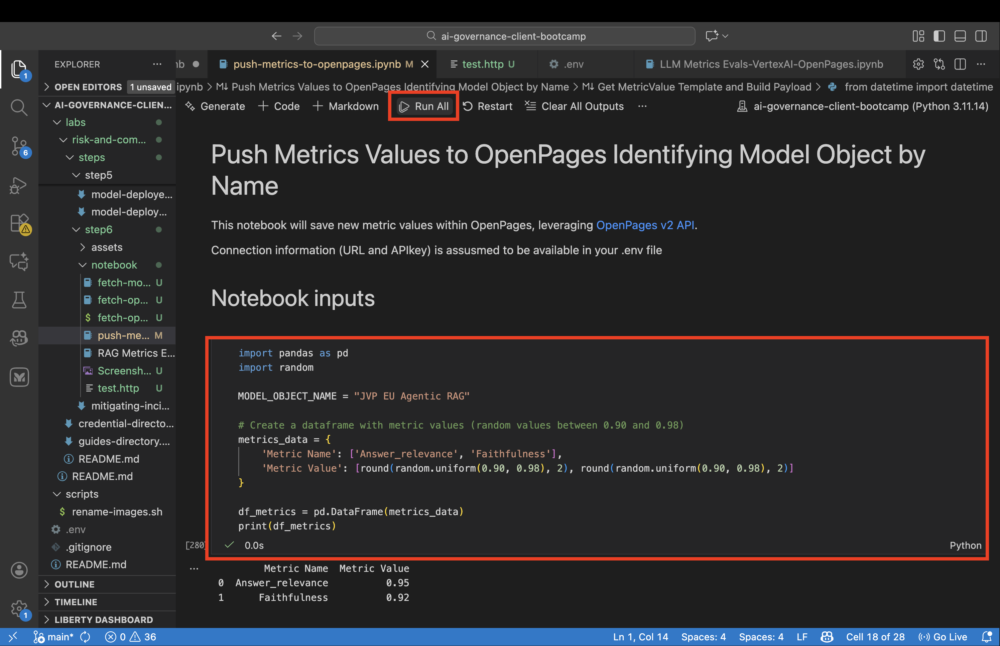
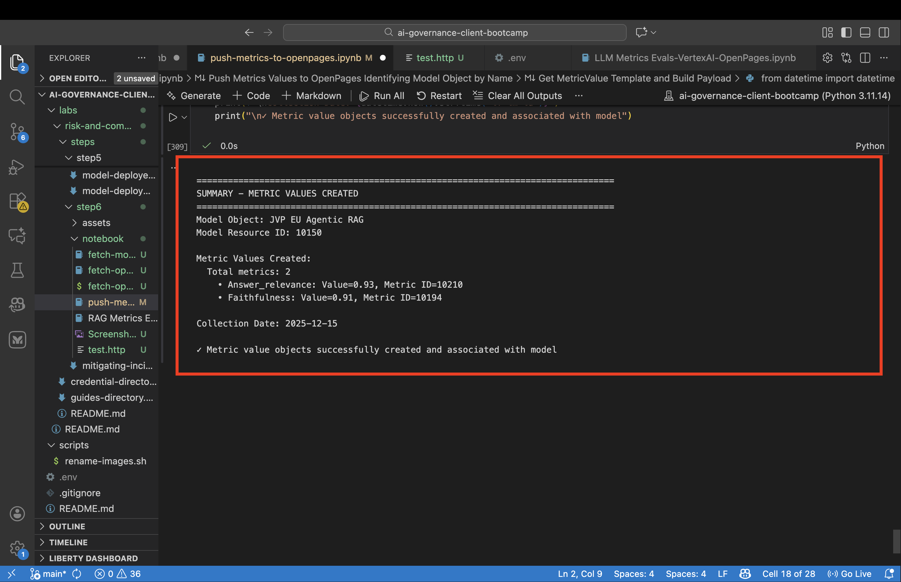
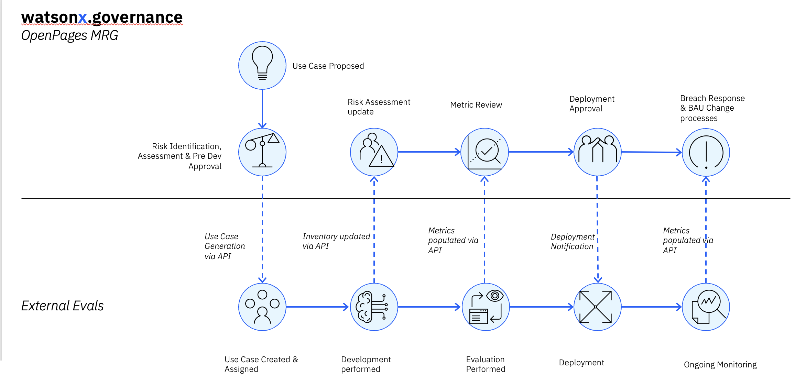

# Integrating External Evaluation Engine with OpenPages

## Step 1: Review Metrics in OpenPages

Go to the OpenPages application and locate your UseCase (example: JVP_AskrHR Automation using Agentic AI). Review the Metrics associated with the UseCase.

The Metric list depends on your Evaluation tool capabilities and the Risk Assessment. During the Risk Assessment, the reviewer identifies particular metrics to monitor.

## Step 2: View Collected Metric Values

Click on a Metric to view all Metric Values collected so far. In this example, only one value had been collected. 

**Note:** Metrics are collected as average scores over a collection period, not for each individual transaction. To collect metrics at the transaction level, implement that functionality in your Evaluation solution. 
 

## Step 3: Execute the Notebook

To push metric values to OpenPages programmatically, you will find an example [notebook](./notebook/push-metrics-to-openpages.ipynb), download the notebook and run it locally on your latop or in watsonx.ai Studio:

1. **Setup Environment Variables:** Create a `.env` file with the following variables:
   - `WX_API_KEY`: IBM Cloud API Key
   - `OP_URL`: OpenPages API Base URL
   
   See [API Key Setup Instructions](../../instructor/api_key_setup.md) for details.

2. **Update the Model Name:** Modify the notebook to use your Model Name.

3. **Run All Cells:** Click on Run All to execute the notebook.

## Step 4: Verify Notebook Completion

Ensure the notebook executes successfully to the end.

## Step 5: Review Newly Created Metric Values

Return to the OpenPages application to view the newly created Metric Values.

## Integration Overview

This approach leverages the OpenPages API to integrate external Evaluation applications seamlessly:

- **External Evaluation Application:** Computes average scores for each selected metric over an evaluation period
- **OpenPages MRG:** Receives and stores these average scores via API
- **Optional Enhancement:** Add a link to enable users to jump from OpenPages to the external Evaluation application frontend and drill down into transaction-level details that explain the metric value

## Next Steps

This integration demonstrates one integration point between an external evaluation engine and OpenPages MRG. For a complete integration, consider the following integration points:

Remember that you can also everaging IBM Watson Governance Model Management for out-of-the-box integrations

[← Back to main guide](./mitigating-incidents.md)